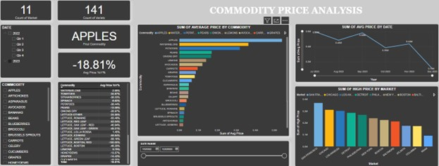

# Data-Analysis-Portfolio
Portfolio showcasing Data Analysis projects

# About Me

Hi, I'm Abayomi Ogundeji, an entry-level Data Analyst with a passion for transforming data into actionable insights. I have a strong foundation in data analysis and visualization, with experience using a variety of tools and technologies, including Excel, SQL, Power BI, and Python, and Google Data Studio. 

## Skills & Tools

- **Excel**: Advanced knowledge of Excel, including pivot tables, VLOOKUP, complex formulas, and data visualization.
- **SQL**: Proficient in writing SQL queries to extract, clean, and analyze data from relational databases.
- **Power BI**: Skilled in creating interactive dashboards and reports for data visualization and business decision-making.
- **Python**: Experience in using Python for data manipulation (with Pandas), data visualization (with Matplotlib and Seaborn), and performing basic statistical analysis.
- **Google Data Studio**: Skilled in creating interactive and user-friendly reports and dashboards that present data in a visually compelling way, enabling easy collaboration and sharing.

## What I Do

I enjoy working with data to uncover patterns, trends, and insights that help businesses make informed decisions. My projects typically involve:
- **Data Cleaning & Preprocessing**: Ensuring datasets are accurate, complete, and ready for analysis.
- **Exploratory Data Analysis (EDA)**: Using Python, Excel, and Power BI to explore data and generate insights.
- **Data Visualization**: Creating compelling visualizations that make complex data easier to understand and communicate.
- **Reporting & Dashboards**: Designing interactive and informative reports and dashboards in Power BI to track key metrics.

##Project 1
 
## Let's Connect

I’m excited to continue learning and growing as a data analyst. Feel free to check out my projects, and don’t hesitate to reach out if you have any questions or opportunities for collaboration.

