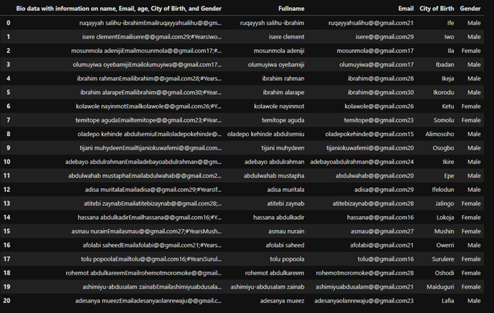

# Biodata Cleaning

This report outlines the data cleaning procedures performed on the biodata of a group of people. The dataset was initially loaded from an Excel file titled "Dirty Data.xlsx" and underwent a series of transformations to improve its quality and structure.

1. Loading the Dataset
   - The dataset was read into a pandas DataFrame using `pd.read_excel("Dirty Data.xlsx")`.
  

2. Splitting Bio Data
   - A column named `"Bio data with information on name, Email, age, City of Birth, and Gender"` was present in the dataset.
   - The content of this column was split into separate columns: `Fullname`, `Email`, `City of Birth`, and `Gender`.
   - The splitting was done using the delimiters `Email`, `;#Years`, and `Gender`, utilizing the `str.split()` method with a regular expression: 
   
  “data[["Fullname","Email","City of Birth","Gender"]] = data["Bio data with information on name, Email, age, City of Birth, and Gender"].str.split(r"Email|;#Years|Gender", expand=True)”

3. Dropping the Original Bio Data Column
   - After extracting the relevant information, the original `"Bio data with information on name, Email, age, City of Birth, and Gender"` column was deleted from the DataFrame:

    “del data["Bio data with information on name, Email, age, City of Birth, and Gender"]”
 

4. Extracting and Cleaning Age Information
   - The `Age` was extracted from the `Email` column (which still contained age digits) using a regular expression:
 
 “data.insert(2, "Age", data["Email"].str.extract("(\\d+)"))”

 
 - The age digits were then removed from the `Email` column using `str.replace()`:
     “data["Email"] = data["Email"].str.replace("(\\d+)", "", regex=True)”
5. Correcting Email Formatting
   - The `Email` column initially contained double `@@` symbols. This was corrected by replacing `@@` with a single `@`:   
“data["Email"] = data["Email"].str.replace("@@", "@", regex=False)”
 

6. Standardizing Full Names
   - The `Fullname` column was standardized to title case, ensuring consistent capitalization:
     
“data['Fullname'] = data['Fullname'].str.title()”

7. Resetting Index and Sorting Data
   - The DataFrame's index was reset to ensure sequential ordering after any row operations:     

“data.reset_index(drop=True)”
  
 - The dataset was sorted alphabetically by the `Fullname` column: 
“data = data.sort_values("Fullname", ascending=True)”   
 

Summary
The data cleaning process involved extracting key information from a complex column, correcting formatting issues, and standardizing the data to improve its quality and usability. The final DataFrame was structured with well-defined columns for `Fullname`, `Email`, `Age`, `City of Birth`, and `Gender`, sorted and indexed for easy analysis and further processing.
